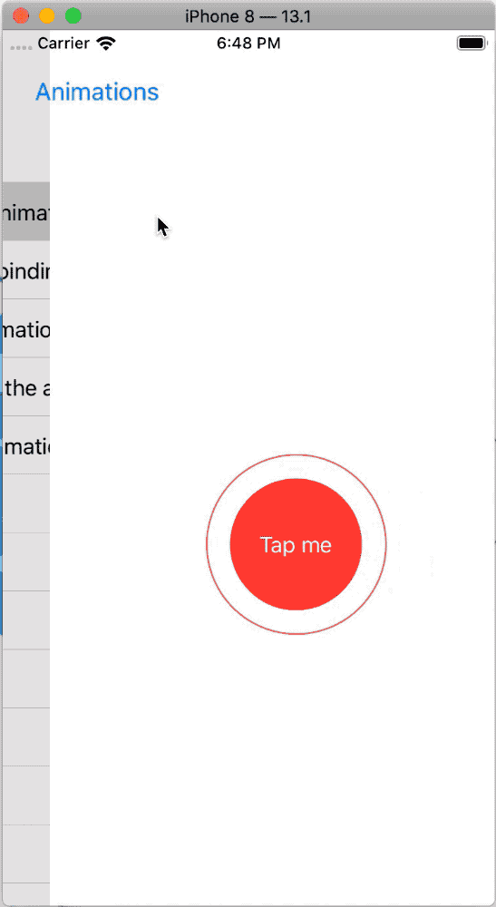

# Project 6. Animations

This project looks at a range of animations and transitions with SwiftUI.

## Topics

- Implicit animations
- Animating bindings
- Explicit animations

## Images

## Notes

- We can ask SwiftUI to create an **implicit animation** for our changes so that everything runs smoothly by adding the `.animation(.default)` modifier.

- An implicit animation takes effect on all properties of the view that changes, meaning that if we attach more animating modifiers to a view then they will all change together.

- The parameter passed to the `.animation(_:)` modifier conrols the type of animation used. Some of them are:
    - `.easeOut`: Makes the animation start fast then slow down
    - There are seven spring animations
        - `stiffness`: sets its initial velocity
        - `damping`: lower values cause the spring to bounce back and forth for longer.

- We can make an animation to repeat a certain number of times with `.repeatCount` and make it bounce back and forward by setting `autoreverses` to `true`.

- Using the `repeatForever()` and `onAppear` modifiers at the same time, we can create animations that start immediately and continue animating for the life of the view.

- The `animation()` modifier **can be applied** to any SwiftUI **binding** which causes the value to animate between its current and new value.

- In implicit animations, the state change has no idea it will trigger an animation; in binding animations the view has no idea it will be animated.

- When using explicit animations we ask SwiftUI that we want an animation to occur when some arbitrary state change occurs.

- The order in which we apply animations matters: only changes that occur before the `animation()` modifier get animated.

- It's possible to disable animations entirely by passing `nil` to the modifier.

- We can use the `transition()` modifier to control how a view is shown and hidden. A useful transition is `.assymetric` that lets you use one transition when the view is shown, and other one when it's disappearing. 