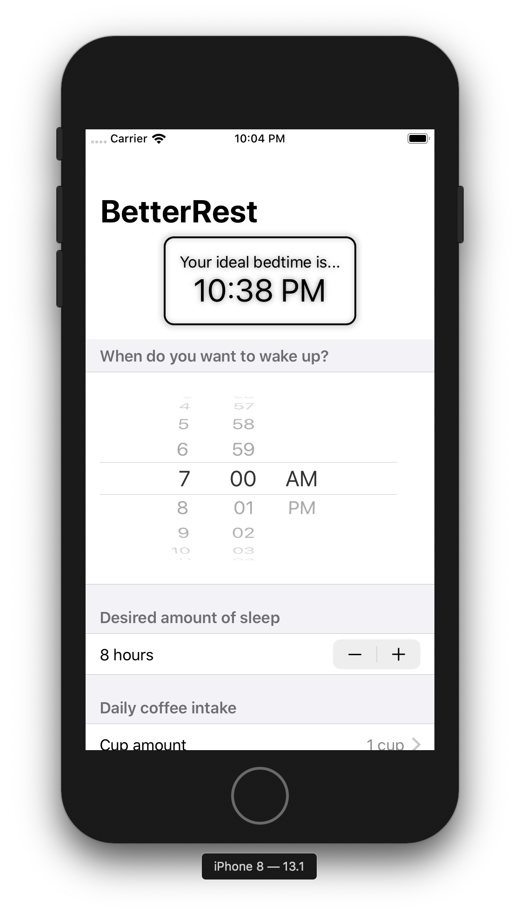

# Project 4. Better Rest

The app is designed to help coffee drinkers get a good night’s sleep by asking them three questions:

1. When do they want to wake up?
2. Roughly how many hours of sleep do they want?
3. How many cups of coffee do they drink per day?

The app feeds those three values to CoreML to get a result when they ought to go to bed.

## Challenges

1. Replace each VStack in our form with a Section, where the text view is the title of the section. Do you prefer this layout or the VStack layout? It’s your app – you choose!

2. Replace the “Number of cups” stepper with a Picker showing the same range of values.

3. Change the user interface so that it always shows their recommended bedtime using a nice and large font. You should be able to remove the “Calculate” button entirely.

## Images

<p align="center"></p>

## Notes

- An `Stepper` is a `View` used to let users enter numbers. Steppers can be bound to `Int`, `Double` and more, and it will automatically adapt.

- The `%g` format specifier removes unnecessary zeroes from numbers. For example 8.0000 becomes just 8, and 8.2500 becomes 8.25.

- The `displayedComponents` parameter of the `DatePicker` initializer can be used to decide what kind of options users will see:
    - `.date` will show day, hour and a minute.
    - `.hourAndMinute` will show just the hour and minute.

- A **one sided range** is a range where we specify either the start or end, but not both, leaving Swift to infer the other side. For example, a range from all possible dates starting from today:

```swift
let today = Date()

// This means "from the current date up to anything".
let allPossibleFutureDates = today...
```

- Wheel pickers are only available in iOS.

