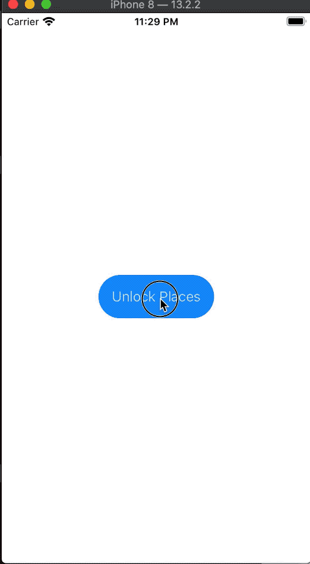

# Project 14. BucketList

## Topics

- Codable
- MapKit
- LocalAuthentication
- `Comparable`
- The `UIViewRepresentable` and `UIViewControllerRepresentable` protocols.
- FileManager
- Operator overloading
- `LAContext`
- `MKMapView`, `CLLocationCoordinate2D` CoreLocation

## Images

## Notes

- Conforming to `Comparable` gives access to the `<`, `>`, `<=`, `>=` and `==` operators for our custom types.

- iOS applications are sandboxed, which means they run in their own container with a hard to guess directory name.

- iOS can take care of file encryption by using the `.completeFileProtection` option when writing a file.

- Coordinator classes help us respond to actions in a `UIView` or `UIViewController`.

- Conforming to `Comparable` give us access to a `sorted()` method that takes no parameters when using our types with Arrays.

- Writing data **atomically** means that iOS writes to a temporary file, then performs a rename. This is used to avoid reading content from a file that is not entirely saved.

- SwiftUI calls `updateUIView()` from a `UIViewRepresentable` view only when something (like state) has changed. 

- Every iOS app has a documents directory where we can store our files.

- SwiftUI does not let us bind a text field directly to an optional string property. You can bind a computed property that wraps the optional.

- You can reuse map annotation views to improve performance. When reusing, iOS just changes the text rather than destroying and recreating views each time.