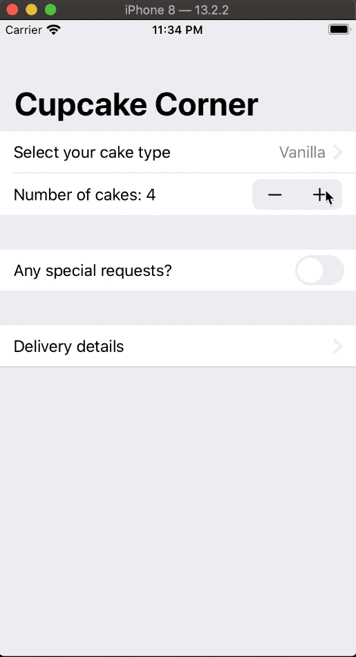

# Project 10. Cupcake Corner

This is a multi-screen app for ordering cupcakes. It uses a couple of forms but focuses more in learning how to make classes conform to `Codable` when they have `@Published` properties, how to send and receive the order data from the internet and how to validate forms using the `disabled` modifier.

## Topics

- Codable with `@Published` properties
- `URLSession`
- `DispatchQueue`

## Images

## Notes

- Any subclass from a class that contains a `required init` must override the initializer with a custom implementation to make sure they add their own values. One way to avoid using `required` in the parent class is marking it as `final class` so that subclassing isn't allowed.

