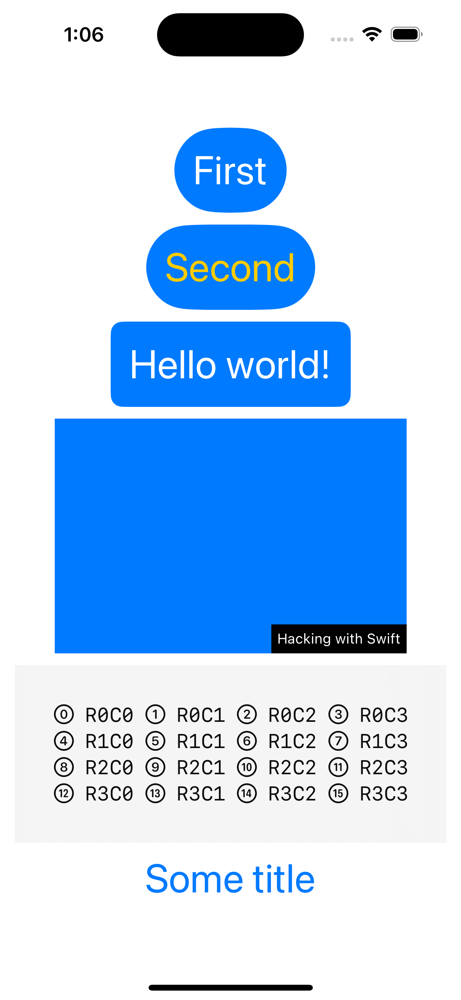

# ViewsAndModifiers

This third SwiftUI project is a technique project, where we explore certain SwiftUI features in depth, looking at how they work in detail along with why they work that way.

In this technique project we take a close look at **views** and **view modifiers**, and answer some of the most common questions at this point:

- Why does SwiftUI use structs for its views? 
- Why does it use some View so much? 
- How do modifiers really work? 

