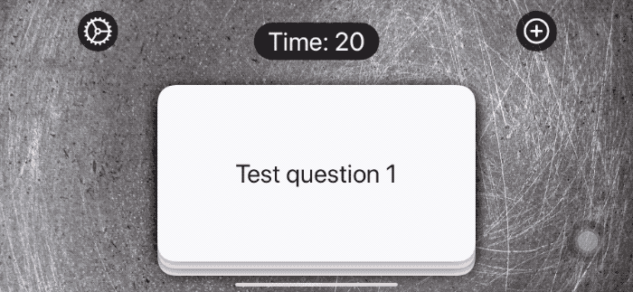

# Project 17. Flashzilla

This is an app that helps users learn things using flashcards - cards with one thing written in one side, and another thing written on the other side.

## Topics

- Gestures
- CoreHaptics
- `allowsHitTesting()`

## Images

## Notes

- SwiftUI lets us control user interactivity in two ways: using the `allowsHitTesting()` and `contentShape()` modifiers.

- When `allowsHitTesting()` is attached to a view with its parameter set to `false`, the view isn't considered tapptable. It doesn't catch any taps, but things behind the view will get tapped instead.

- The `contentShape()` modifier lets us specify the tappable shape for something. For example, the tappable shape for a circle is a circle of the same size.