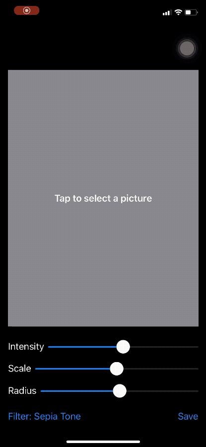

# Project 13. Instafilter

This app lets users import photos from their library, then modify them using various image effects.

## Topics

- Core Image
- Integrating SwiftUI with UIKit
- Creating Custom bindings in SwiftUI
- `UIViewControllerRepresentable`

## Challenges

1. Try making the Save button show an error if there was no image in the image view.

2. Make the Change Filter button change its title to show the name of the currently selected filter.

3. Experiment with having more than one slider, to control each of the input keys you care about. For example, you might have one for radius and one for intensity.

## Images

## Notes

- Core Image is Apple's high-performance framework for manipulating images. It provides things like blurs, color shifts, pixellation and more. It is optimized to take full advantage of the GPU on iOS devices.

- The `@propertyWrapper` attribute is what makes the `State` struct into `@State` for us to use.

- The `@State` property wrapper contains a `wrappedValue` property that is the actual value we're trying to store such as a string.

- Using a property observer with a `@State` property does not normally trigger its actions because `@State` has a `nonmutating` setter.

- Wrapping a UIKit view controller requires  us to create a struct that conforms to `UIViewControllerRepresentable` that contains two methods: 

    - `makeUIViewController()`: Responsible for creating the initial view controller.
    - `updateUIViewController()`: Designed to let us update the view controller when some SwiftUI state changes.

- SwiftUI **coordinators** are designed to act as delegates for UIKit view controllers.