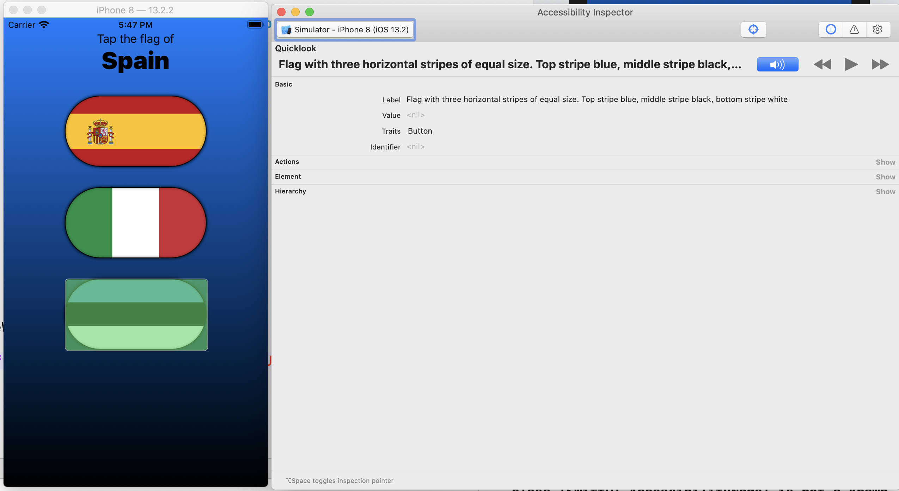
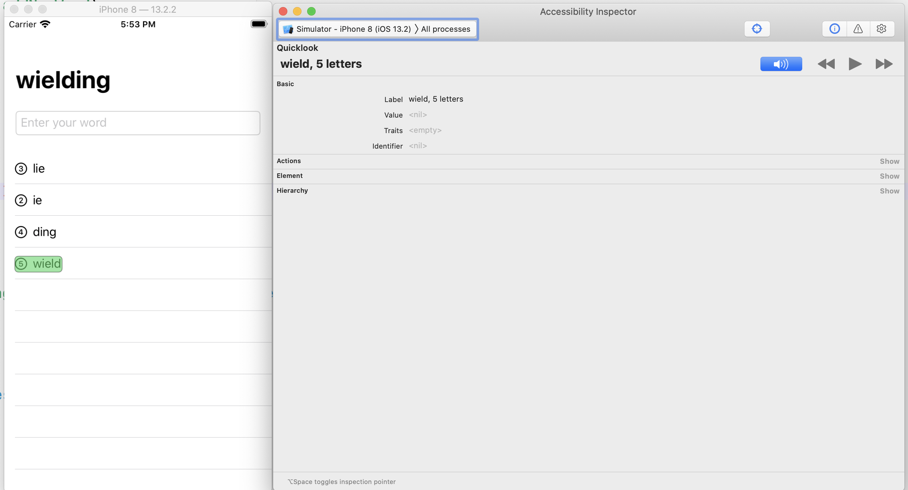
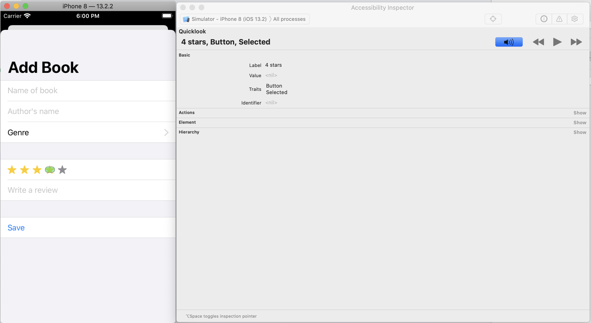

# Project 15. Accessibility

This branch was created to highlight accessibility problems and fixing them in previous projects without modifying the original source.

Projects updated in this branch are the following:

- [GuessTheFlag](GuesstheFlag)

- [WordScramble](WordScramble)

- [Bookworm](Bookworm)

## Changes applied

### Guess The Flag

- Added accessibility labels to each flag.

### Word Scramble

- Make each item in the list read as a single element. 

### Bookworm

- Updated star rating custom component with accessibility labels, remove `.isImage` trait and added `.isButton` and `.isSelected` traits.

