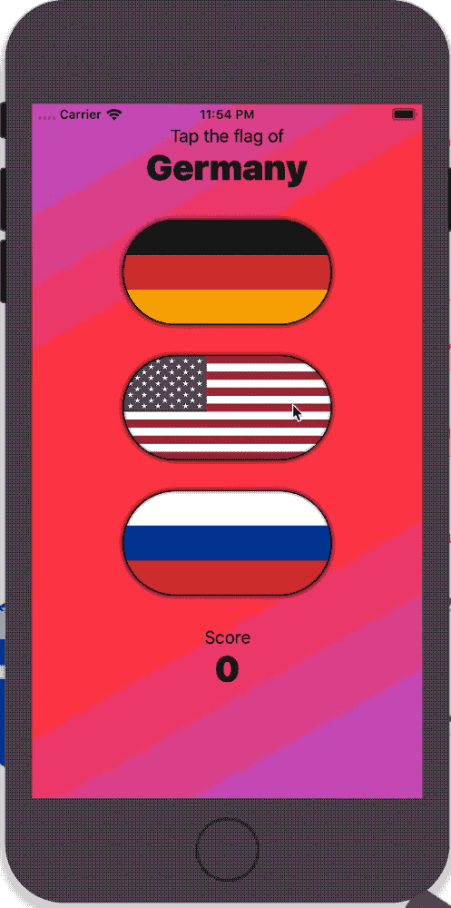

# 100DaysOfSwiftUI

## Wrap-up challenge - Day 34

Go back to the Guess the Flag project and add some animation:

1. When you tap the correct flag, make it spin around 360 degrees on the Y axis.

2. Make the other two buttons fade out to 25% opacity.

3. And if you tap on the wrong flag? Well, that’s down to you – get creative!

## [Solved Challenge](GuessTheFlag)

