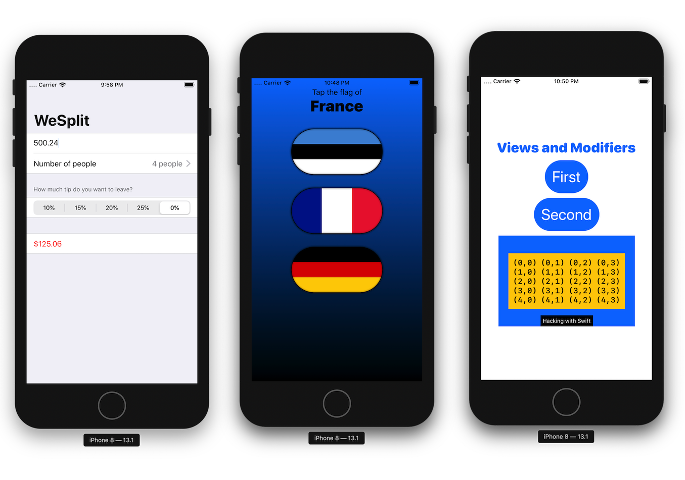

# 100DaysOfSwiftUI

## Wrap-up challenge - Day 24

1. Create a custom ViewModifier (and accompanying View extension) that makes a view have a large, blue font suitable for prominent titles in a view. Solution: [Views and Modifiers](ViewsAndModifiers).

2. Go back to [project 1](WeSplit) and use a conditional modifier to change the total amount text view to red if the user selects a 0% tip.

3. Go back to [project 2](GuessTheFlag) and create a FlagImage() view that renders one flag image using the specific set of modifiers we had.

## Solved challenge

