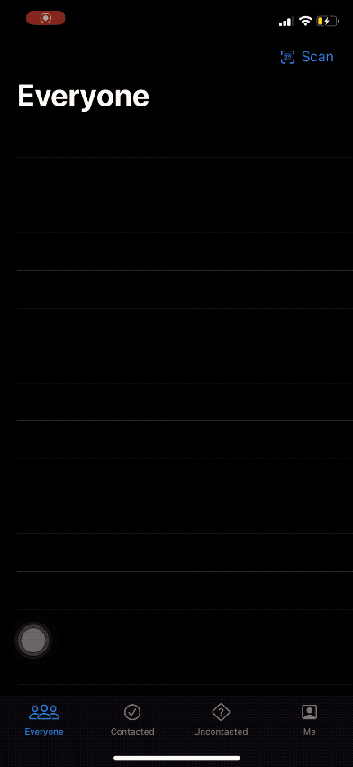

# 100DaysOfSwiftUI

## Wrap-up Challenge - Day 85

1. Add an icon to the “Everyone” screen showing whether a prospect was contacted or not.

2. Use JSON and the documents directory for saving and loading our user data.

3. Use an action sheet to customize the way users are sorted in each screen – by name or by most recent.

## [Solved Challenge](HotProspects)

