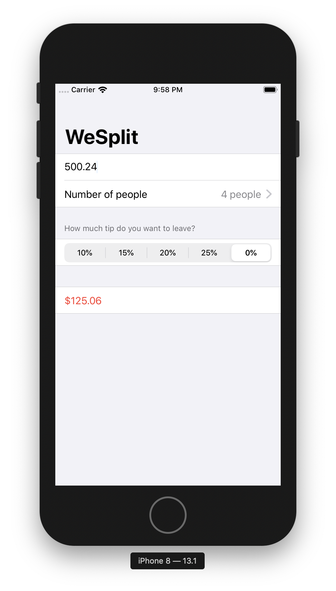

# Project 1. We Split

First project in the 100 Days of SwiftUI challenge. It consists int a check-splitting app that someone may use after eating in a restaurant - you enter the cost of the food, select how much of a tip you want to leave, and how many people you're with, and it will tell you how much each person needs to pay.

## Challenge

Go back to project 1 and use a conditional modifier to change the total amount text view to red if the user selects a 0% tip.

## Images

<p align="center"></p>

## Notes

- The `SceneDelegate.swift` file contains code for **launching one window** in your app. It doesn't do much on iPhone, but on iPad (where users can have multiple instances of an app open at the same time) this is important.

- `ContentView.swift` contains the initial user interface for the app.

- **Preview Content** is a group that contains an `Assets.xcassets` asset catalog inside for example images that you want to use when you're designing your user interfaces, to give you an idea of how they might look when the program is running.

- The `View` protocol comes from SwiftUI, and is the basic protocol that must be adopted by anything you wnat to draw on the screen (text, buttons, images, and more...).

- `some View` means that a computed property or a method will return something that conforms to the `View` protocol but with an important restriction: **it must always be the same kind of view being returned**. You can't sometimes return one type of thing and other times return a different type of thing.

- `Text` views are simple pieces of static text that get drawn onto the screen, and will **automatically wrap** across multiple lines as needed.

- Use `Option + CMD + P` to resume the automatic updating of the canvas.

- `Form` is a view that is used for scrolling lists of static controls like text and images (but can also inlcude user interactive controls like text fields ,switches, buttons and more).

- SwiftUI views limit up to 10 children inside a parent view. If you wanted to have 11 things inside a view, you should put some rows inside a `Group`. For example

```swift
Form {
    Group {
        Text("Hello World")
        Text("Hello World")
        Text("Hello World")
        Text("Hello World")
        Text("Hello World")
        Text("Hello World")
    }

    Group {
        Text("Hello World")
        Text("Hello World")
        Text("Hello World")
        Text("Hello World")
        Text("Hello World")
    }
}
```

- Use `Section` when you want to split items inside a `Form`.

- **Modifiers** are methods that always return a new instance of whatever you use them on.

- `NavigationView` lets you add a navigation bar in SwiftUI. They can have titles and buttons, and they are also used to dipslay new views when the user performs an action.

- A **property wrapper** is a special attribute we can place before our properties that effectively gives them *superpowers*.

- The `@State` property wrapper allows us to store simple program state (like the number of times a button was tapped). It allows us to work around the limitation of structs immutability. `@State` allows a value to be stored separately by SwiftUI in a place that **can be modified**.

- `@State` is designed for simple properties that are stored **in one view**. Apple recommends marking these properties with `private`.

- In SwiftUI, views are a function of their state: everything the user can see is just the visible representation of the structs and properties in our code.

- Swift differentiates between *"show the value of this property here"* (**one-way binding**) and *"show the value of this property here, but write any changes back to the property"* (**two-way binding**).

- In SwiftUI, two-way bindings are marked with a special symbol so that they stand out: the dollar sign `$`. This indicates that Swift should read the value of the property but also write any changes back.

```swift
struct ContentView: View {
    @State private var name = ""

    var body: some View {
        // Two-way binding is required because `name` might change.
        TextField("Enter your name", text: $name)

        // Two-way binding is not required. There's no way `name` can change.
        Text("Your name is \(name)")
    }
}
```

- `ForEach` can loop over arrays and ranges to create as many views as needed. It also doesn't get git by the 10-view limit that occurs when typing the view by hand.

- Swift can format numbers inside **string interpolation** using [C-like format specifiers]( https://en.wikipedia.org/wiki/Printf_format_string).

```swift
Text("$\(amount, specifier: "%.2f")")
```