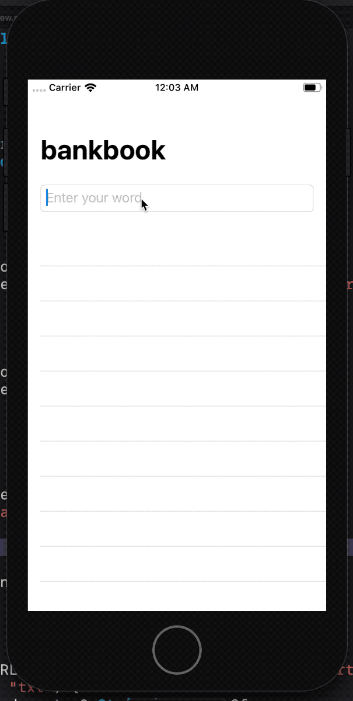

# Project 5. Word Scramble

This app will show players a random eight-letter word, and ask them to make words out of it. For example, if the starter word is “alarming” they might spell “alarm”, “ring”, “main”, and so on.

## Challenges

1. Disallow answers that are shorter than three letters or are just our start word. For the three-letter check, the easiest thing to do is put a check into isReal() that returns false if the word length is under three letters. For the second part, just compare the start word against their input word and return false if they are the same.

2. Add a left bar button item that calls startGame(), so users can restart with a new word whenever they want to.

3. Put a text view below the List so you can track and show the player’s score for a given root word. How you calculate score is down to you, but something involving number of words and their letter count would be reasonable.

## Images

<p align="center"></p>

## Notes

- `List` is a view used to provide a scrolling table of data. It's identical to `Form`, except it's used for presenting data rather than requesting user input.

- `List` can generate dynamic content without using a `ForEach`

```swift
List(0..<5) {
    Text("Dynamic row \($0)")
}
```

- When working with an array of data, SwiftUI still needs to know how to identify each row uniquely, so if one gets removed it can simply remove that one rather than having to redraw the whole list. When working with arrays of strings and numbers, the only thing that makes those values unique is the values themselves. That is, if we had the array `[2, 4, 6, 8, 10]`, then those numbers themselves are themselves the unique identifiers. When working with this kind of list data, we use id: `\.self` when using `List`.

- When Xcode builds your iOS app, it creates something called a **bundle**. This happens on all of Apple’s platforms, including macOS, and it allows the system to store all the files for a single app in one place – the binary code (the actual compiled Swift stuff we wrote), all the artwork, any extra files we need, our *Info.plist* file, and more, all in one place.


